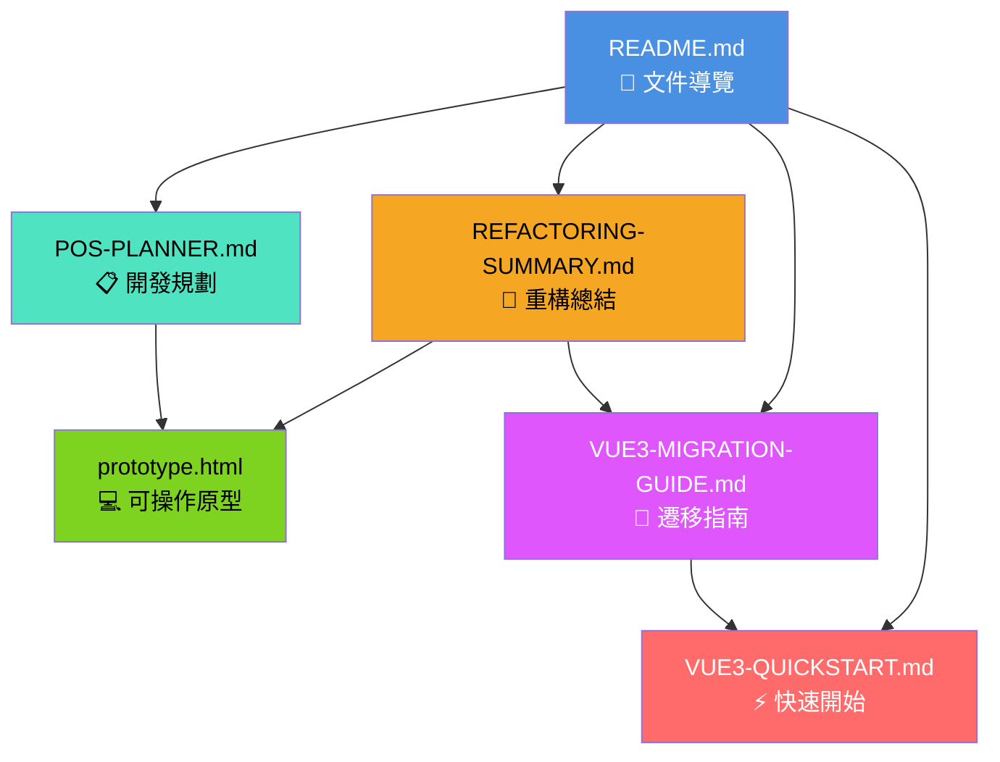
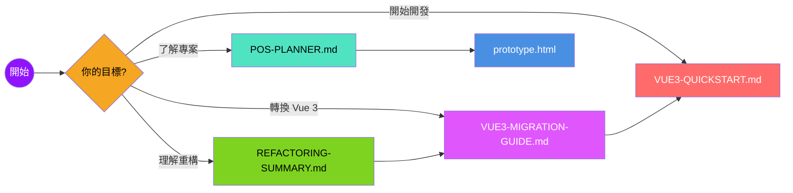

# POS 系統文件結構圖

> **最後更新**：2026-02-08
> **維護者**：Claude Code Assistant

---

## 📂 文件組織結構

```
pos/
├── prototype.html                    # 可操作原型（當前版本）
├── docs/                             # 技術文件目錄
│   ├── README.md                     # 🔵 文件導覽（入口點）
│   ├── POS-PLANNER.md                # 📋 開發規劃
│   ├── REFACTORING-SUMMARY.md        # 🔧 重構總結
│   ├── VUE3-MIGRATION-GUIDE.md       # 🚀 遷移指南
│   ├── VUE3-QUICKSTART.md            # ⚡ 快速開始
│   └── DOCS-STRUCTURE.md             # 📊 本文件（結構說明）
└── src/                              # 未來 Vue 3 專案原始碼
    ├── components/                   # Vue 元件
    ├── stores/                       # Pinia 狀態管理
    ├── composables/                  # 組合式函數
    └── utils/                        # 工具函數
```

---

## 🔗 文件關係圖

### 1. 文件導航結構



### 2. 閱讀路徑圖



---

## 📋 文件用途說明

### 🔵 README.md - 文件導覽
- **用途**：文件總覽與導航入口
- **目標讀者**：所有開發者
- **內容**：
  - 文件地圖
  - 快速導航
  - 閱讀順序建議
  - 核心概念速覽
  - 當前進度追蹤
- **何時閱讀**：第一次接觸專案時

### 📋 POS-PLANNER.md - 開發規劃
- **用途**：完整的專案規劃文件
- **目標讀者**：專案經理、技術負責人
- **內容**：
  - 專案概述與目標
  - 核心功能需求
  - 技術堆疊選擇
  - Phase 1-4 發展規劃
  - 資料庫結構設計
  - 開發進度追蹤
  - 更新記錄
- **何時閱讀**：需要了解專案全貌時

### 🔧 REFACTORING-SUMMARY.md - 重構總結
- **用途**：狀態管理重構的詳細說明
- **目標讀者**：開發者
- **內容**：
  - 重構目標與動機
  - appState 架構說明
  - StateManager API 使用
  - Utils 工具函數
  - 向後兼容層實作
  - 已知限制與待辦事項
  - 速查表（appState、StateManager、Utils）
- **何時閱讀**：需要理解現有架構或準備轉換 Vue 3 時

### 🚀 VUE3-MIGRATION-GUIDE.md - 遷移指南
- **用途**：原型程式碼轉換成 Vue 3 的對照指南
- **目標讀者**：開發者
- **內容**：
  - Vue 3 轉換步驟
  - 原型程式碼 → Vue 3 對照
  - Pinia Store 架構設計
  - 元件化拆分策略
  - 詳細轉換範例
  - 最佳實踐建議
- **何時閱讀**：準備將原型轉換成 Vue 3 時

### ⚡ VUE3-QUICKSTART.md - 快速開始
- **用途**：Vue 3 專案初始化步驟
- **目標讀者**：開發者
- **內容**：
  - 專案初始化步驟
  - Vite 配置說明
  - TypeScript 設定
  - Vant 4 整合
  - Pinia 狀態管理
  - 開發流程指引
- **何時閱讀**：準備建立 Vue 3 專案時

### 💻 prototype.html - 可操作原型
- **用途**：當前可操作的原型系統
- **目標讀者**：所有使用者
- **內容**：
  - 完整的點餐系統
  - 結帳功能
  - 銷售報表
  - 重構後的狀態管理架構
- **何時使用**：測試功能或參考實作

---

## 🎯 使用情境建議

### 情境 1：新加入開發者
```
1. 閱讀 README.md 了解文件結構
2. 閱讀 POS-PLANNER.md 了解專案全貌
3. 閱讀 REFACTORING-SUMMARY.md 理解架構
4. 測試 prototype.html 熟悉功能
5. 閱讀 VUE3-MIGRATION-GUIDE.md 準備開發
```

### 情境 2：準備轉換 Vue 3
```
1. 閱讀 REFACTORING-SUMMARY.md 理解現有架構
2. 閱讀 VUE3-MIGRATION-GUIDE.md 了解對照關係
3. 閱讀 VUE3-QUICKSTART.md 建立專案
4. 參考 prototype.html 實作
```

### 情境 3：只想了解重構
```
1. 閱讀 REFACTORING-SUMMARY.md（主文件）
2. 參考 VUE3-MIGRATION-GUIDE.md 的對照範例（選讀）
```

### 情境 4：專案管理
```
1. 閱讀 README.md 查看進度
2. 閱讀 POS-PLANNER.md 了解規劃
3. 查看 prototype.html 測試功能
```

---

## 📊 文件維護狀態

| 文件 | 狀態 | 版本 | 最後更新 | 優先級 |
|------|------|------|----------|--------|
| README.md | ✅ 完成 | v1.0 | 2026-02-08 | 高 |
| POS-PLANNER.md | ✅ 完成 | v5.1 | 2026-02-08 | 高 |
| REFACTORING-SUMMARY.md | ✅ 完成 | v1.0 | 2026-02-08 | 高 |
| VUE3-MIGRATION-GUIDE.md | ✅ 完成 | v1.0 | 2026-02-08 | 高 |
| VUE3-QUICKSTART.md | ✅ 完成 | v1.0 | 2026-02-08 | 中 |
| DOCS-STRUCTURE.md | ✅ 完成 | v1.0 | 2026-02-08 | 低 |

---

## 🔄 文件更新流程

### 何時更新文件？
- ✅ 完成功能開發後
- ✅ 進行重構後
- ✅ 架構變更後
- ✅ 發現錯誤或遺漏後
- ✅ 定期審查（建議每週）

### 更新步驟
1. 確定需要更新的文件
2. 更新版本號（如 v1.0 → v1.1）
3. 更新最後更新日期
4. 記錄更新內容到「更新記錄」
5. 同步更新相關文件的交叉連結
6. 測試所有連結是否正確
7. 提交變更並說明原因

### 版本號規則
- **主版本號**（Major）：架構重大變更
- **次版本號**（Minor）：新增內容或功能
- **修訂號**（Patch）：錯誤修正或小幅調整

範例：
- v1.0 → v2.0：架構重構
- v1.0 → v1.1：新增章節
- v1.0 → v1.0.1：修正錯字

---

## 📝 文件撰寫規範

### 格式要求
- ✅ 使用 Markdown 格式
- ✅ 使用繁體中文
- ✅ 程式碼範例使用語法高亮
- ✅ 使用表情符號增加可讀性
- ✅ 標題層級清晰（# → ## → ###）

### 內容要求
- ✅ 提供具體範例
- ✅ 包含快速參考表
- ✅ 說明「為什麼」而不只是「怎麼做」
- ✅ 保持文件間的一致性
- ✅ 定期更新過時內容

### 連結要求
- ✅ 使用相對路徑（如 `./README.md`）
- ✅ 所有文件互相連結
- ✅ 外部連絡註明日期（可能失效）
- ✅ 重要概念提供外部參考連結

---

## 🔍 快速查找

### 按主題查找

**想了解...**
- 專案規劃 → [POS-PLANNER.md](./POS-PLANNER.md)
- 重構內容 → [REFACTORING-SUMMARY.md](./REFACTORING-SUMMARY.md)
- Vue 3 轉換 → [VUE3-MIGRATION-GUIDE.md](./VUE3-MIGRATION-GUIDE.md)
- 建立專案 → [VUE3-QUICKSTART.md](./VUE3-QUICKSTART.md)
- 文件導覽 → [README.md](./README.md)

**想查找...**
- appState 結構 → [REFACTORING-SUMMARY.md #appState-結構](./REFACTORING-SUMMARY.md#appstate-結構)
- StateManager API → [REFACTORING-SUMMARY.md #statemanager-速查表](./REFACTORING-SUMMARY.md#statemanager-速查表)
- Pinia Store 設計 → [VUE3-MIGRATION-GUIDE.md #phase-2狀態管理轉換](./VUE3-MIGRATION-GUIDE.md#phase-2狀態管理轉換)
- 元件拆分 → [VUE3-MIGRATION-GUIDE.md #phase-3元件化拆分](./VUE3-MIGRATION-GUIDE.md#phase-3元件化拆分)

---

**文件版本**：v1.0
**建立日期**：2026-02-08
**最後更新**：2026-02-08
**維護者**：Claude Code Assistant
